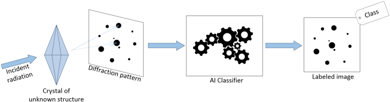
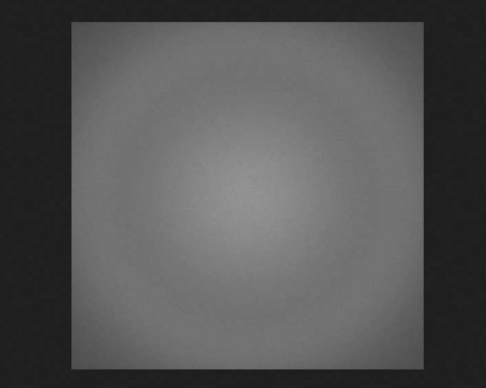
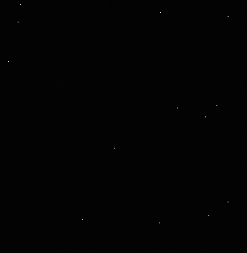
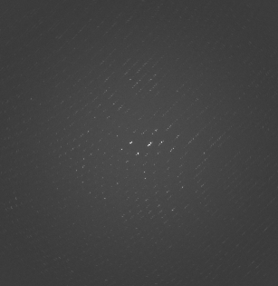
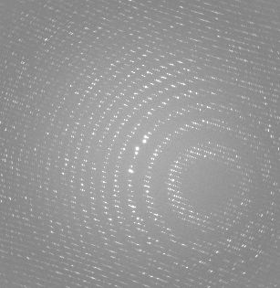
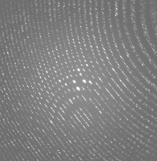
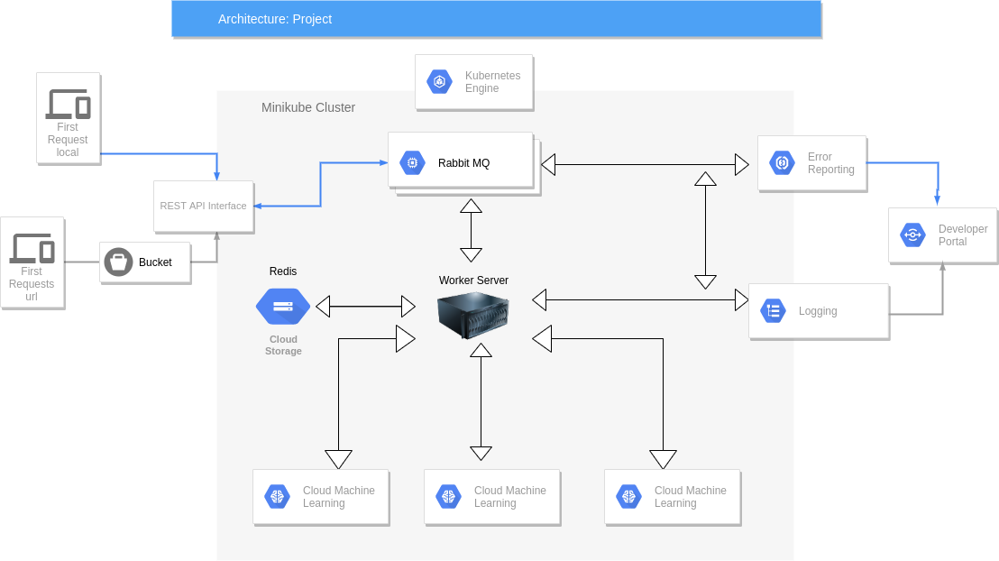

# Implementation of a Distributed Image Classifier to Separate Useful from Useless Images in Crystallographic Experiments
#### Author: Sabine Hollatz
Git Repository: https://github.com/SHollatz/CSPB5253-Datacenter-Scalecomputing-project

### Background - The Research Context
This project is part of my internship at the National Accelerator Laboratory SLAC with
the Molecular Crystallography group.
When protein molecules are in crystallized form and are shot with x-rays, their
detected diffraction pattern can provide insight to the molecular structure of a single
protein molecule. [The following image was provided by Luigi Nardi](https://dawn.cs.stanford.edu/2019/04/23/deepfreak/) <br>This is how many protein, RNA, and DNA structures were
discovered such as lysozyme or the zika virus shell. When a molecular structure is
discovered, the proteins functionality can be understood and, in case of pathogens,
medication can be developed. The video below provides a brief overview of the way the experiments are conducted. Crystallographic experiments are currently deducted
with the recent coronavirus 2 (SARS-CoV-2). [More information to Covid-19 research at SLAC](https://www.iucr.org/news/newsletter/volume-28/number-2/ssrl-joins-global-fight-against-covid-19)<br>
Machine Learning is requested, because current detectors can take thousands of
images per second, so that a pre-screening for quality by the human eye is not
feasible anymore. A machine learning model could give useful feedback about the
potential success or failure of an experiment in real time. This is particularly useful in
serial crystallography, where proteins are used that are difficult to crystallize, so that
the protein sample size is small. Therefore the number of useful images is small as
well, but the number of total images is large.


```python
from IPython.lib.display import YouTubeVideo
YouTubeVideo('mYz3KEDQDwQ')
# Link: https://youtu.be/mYz3KEDQDwQ
```


<iframe
    width="400"
    height="300"
    src="https://www.youtube.com/embed/mYz3KEDQDwQ"
    frameborder="0"
    allowfullscreen
></iframe>


### Background - The Data
Even though diffraction images are all grayscale images that show white dots on a
circular background, they can be quite different and are unique for each molecular
structure. The current training and testing images are simulated with James Holton's simulator because real data is difficult to label. They have a size of 307x315 pixels. To provide an idea of diffraction images in general, I selected the following
6 images:


```python
from IPython.display import HTML, display
display(HTML("<table>Images without Diffraction (blank or no crystal)<tr><td></td><td></td><td></td></tr></table>"))

```


<table>Images without Diffraction (blank or no crystal)<tr><td></td><td></td><td></td></tr></table>


```python
display(HTML("<table>Diffraction Images<tr><td>weak diffraction</td><td>good diffraction</td><td>strong diffraction</td></tr></table>"))
```


<table>Diffraction Images<tr><td>weak diffraction</td><td>good diffraction</td><td>strong diffraction</td></tr></table>


### Project Goals
I have set up a scalable, distributed system that classifies diffraction images from
crystallographic experiments into two categories: images that can provide valuable
information (show diffraction) and images that are useless to the researcher (no
diffraction). In the future I will optimize the throughput and enable more convenient query methods to the database.

### The Architecture


<ul>
    <li>The entry to the application is provided by an ingress to a REST API interface</li>
    <li>Message queues enable the communication between the entry REST API interface, the worker server, the redis databases and the logging service.</li>
    <li>Storage for image hashes, filenames and prediction results is provided in a redis database</li>
<li>The entire application is organized in a Minikube Cluster using Kubernetes and Docker containers. That way  transportability and scalability are enabled.</li>

### Used Technologies
The application is written in Python and uses the following libraries: codecs, flask, hashlib, io, json, jsonpickle, numpy, os, pickle, pika, Pillow, platform, redis, requests, sys, time.
Kubernetes is used with Docker Containers on a local Minikube cluster. Pods are managed by deployments and services in form of yaml files. Networking between pods is enabled through services, environmental variables and an internal dns service provided by Kubernetes. The entry is given by an ingress which provides a public IP address. Test images are stored in a bucket on Google Cloud. The REST API interface manages and forwards the incoming client requests through a RabbitMQ brokered communication system to the workers as well as to the database and the logging system. The deep learning classifier was previously trained and saved in H5 format. To serve the model in a production environment, it is stored in a pb format and added to a tensorflow serving docker container. The prediction request to the tensorflow serving model uses HTTP. The image filename, image hash, and the prediction results are stored in 3 redis databases, so that the integrity of the image files can be ensured without the overload of storing the image files themselves.

### Main Steps in Creating and Running the Application
These steps need to be performed from command line and not in a jupyter notebook. For this reason they are shown as text instead of executable code.

#### Starting the minikube cluster


```python
minikube start
minikube addons configure registry-creds
# https://index.docker.io/v1/
minikube addons enable ingress
```

#### Creating the Tensorflow Serving Docker Image
The model was saved in the Hierarchical Data Format H5, which contains multidimensional arrays of scientific data, but needs to become a tensorflow pb format in order to be used with tensorflow serving. A model saved in pb format contains the complete graph, including weights and computation. 


```python
import tensorflow as tf
model = tf.keras.models.load_model("./model/vgg16_diff-nodiff_classification.h5")
tf.keras.models.save_model(model, "./model/1/vgg16_diff-nodiff_classification.pb", save_format="tf")
# directory '1' was added because tensorflow serving expects a version specification at that point.
```


```python
docker pull tensorflow/serving
docker run -d --name serving_base tensorflow/serving
docker cp ../model/vgg16_diff-nodiff_classification.pb serving_base:/models/vgg16_diff-nodiff_classification.pb
docker commit --change "ENV MODEL_NAME vgg16_diff-nodiff_classification.pb" serving_base vgg16_diff-nodiff_classifier

# pushing to docker hub
docker tag d7bb33b5297e shollatz/vgg16_diff-nodiff_classifier:v1
docker push shollatz/vgg16_diff-nodiff_classifier:v1
```

#### Starting Kubernete Pods, Deployments, Services and the Ingress


```python
kubectl apply -f redis/redis-deployment.yaml
kubectl apply -f redis/redis-service.yaml
kubectl apply -f rabbitmq/rabbitmq-deployment.yaml
kubectl apply -f rabbitmq/rabbitmq-service.yaml
kubectl apply -f worker/tfserving-deployment.yaml
kubectl apply -f worker/tfserving-service.yaml
kubectl apply -f worker/worker-deployment.yaml
kubectl apply -f rest/rest-deployment.yaml
kubectl apply -f rest/rest-service.yaml
kubectl apply -f rest/logs-deployment.yaml
kubectl apply -f rest/rest-ingress.yaml
```

### Example Run Shown in Demo Video
To show changes in the database I have written a python script that can be executed interactivly inside the pod with the container ml-worker. I am going to execute it once before to show that the database is empty and once after a curl command is executed. The sample images are stored in a bucket on Google Cloud.


```python
kubectl get pods
```


```python
kubectl exec --stdin --tty <worker-deployment-pod> /bin/sh
# run inside the pod:
python3 redis-list.py
```


```python
kubectl describe ingress frontend-ingress
```


```python
REST = 192.168.49.2
curl -d '{"url":"https://storage.googleapis.com/csci4253_project_images/fake_20804.png"}' -H "Content-Type: application/json" -X POST http://$REST/scan/url
```


```python
kubectl exec --stdin --tty <worker-deployment-pod> /bin/sh
# run inside the pod:
python3 redis-list.py
```

#### Debugging and Testing
I used logging to provide information from every executing node in the system as well as error reporting. The service application was tested first with a few images both from a local file system as well as from a given url. The architecture was built component by component and debugged at every step along the way. It was ensured that the image information can be reproduced after
scanning and storing. 

### Discussion of Component Choices and Future Improvements
Due to time contraints, I could create a minimal viable product, in which all components can communicate with each other to provide the overall functionality of a remote, distributed, scalabel image classifier for diffraction images. Data integrety is provided by the brokered RabbitMQ communication system and stored image hashes in the redis database. However, throughput is an important component that will be optimized in the future. Currently, the incoming communication and the communication between the worker and the tensorflow serving model is following REST and HTTP. gRCP is faster and can be optimized to machine learning with TFRecords.
Furthermore, there will be a choice provided between sending single images and sending images in batches. These two adjustments will enhance the throughput that will be measured with benchmark tests.
